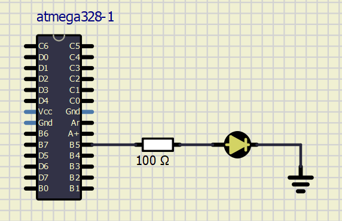

# DE2_LAB7_MEDEK

[Link to GitHub repository](https://github.com/PedroM42/Digital-electronics-2)

## Blink example

1. What is the meaning of the following binary operators in C?
   * `|` OR
   * `&` AND
   * `^` NOR 
   * `~` NOT
   * `<<` left bitwise shift
   * `>>` right bitwise shift

2. Complete truth table with operators: `|`, `&`, `^`, `~`

| **b** | **a** |**b or a** | **b and a** | **b xor a** | **not b** |
| :-: | :-: | :-: | :-: | :-: | :-: |
| 0 | 0 | 0 | 0 | 0 | 1 |
| 0 | 1 | 1 | 0 | 1 | 0 |
| 1 | 0 | 1 | 0 | 1 | 1 |
| 1 | 1 | 1 | 1 | 0 | 0 |

## Morse code

### 1. Listing of C code with syntax highlighting which repeats one "dot" and one "comma" on a LED:

```c
int main(void)
{
    // Set pin as output in Data Direction Register
    // DDRB = DDRB or 0010 0000
    DDRB = DDRB | (1<<LED_GREEN);

    // Set pin LOW in Data Register (LED off)
    // PORTB = PORTB and 1101 1111
    PORTB = PORTB & ~(1<<LED_GREEN);

    // Infinite loop
    while (1)
    {
       // Letter A
        _delay_ms( START_DELAY);
		
        PORTB = PORTB ^ (1<<LED_GREEN);
		_delay_ms( SHORT_DELAY);            //DOT
	    PORTB = PORTB & ~(1<<LED_GREEN);
		
		_delay_ms(BREAK_DELAY);
		
		PORTB = PORTB ^ (1<<LED_GREEN);
		_delay_ms(LONG_DELAY);              //DASH
		PORTB = PORTB & ~(1<<LED_GREEN);
		
		
		
    }

    // Will never reach this
    return 0;
}
```

### 2. Scheme of Morse code application, i.e. connection of AVR device, LED, resistor, and supply voltage. The image can be drawn on a computer or by hand. Always name all components and their values!
 