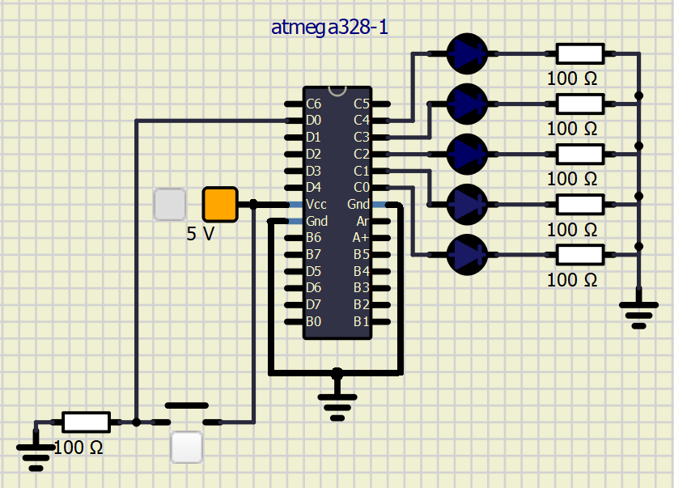

# Lab 3: Petr Medek

Link to my GitHub repository:

   [https://github.com/PedroM42/Digital-electronics-2](https://github.com/PedroM42/Digital-electronics-2)


### Data types in C

1. Complete table.

| **Data type** | **Number of bits** | **Range** | **Description** |
| :-: | :-: | :-: | :-- | 
| `uint8_t`  | 8 | from 0 to 255 | Unsigned 8-bit integer |
| `int8_t`   | 8 | from -128 to 127 | Signed 8-bit integer |
| `uint16_t` | 16 | from 0 to 65535 | Unsigned 16-bit integer |
| `int16_t`  | 16 | from -32768 to 32767 | Signed 16-bit integer |
| `float`    | 32 | from -3.4e+38 to 3.4e+38 | Single-precision floating-point |
| `void`     | 0/2/4/8 | - | Nonvalue-returning function |


### GPIO library

1. In your words, describe the difference between the declaration and the definition of the function in C.
   * Function declaration - it tells the compiler the name of function and how to call the function.
   * Function definition - the body of function.

2. Part of the C code listing with syntax highlighting, which toggles LEDs only if push button is pressed. Otherwise, the value of the LEDs does not change. Use function from your GPIO library. Let the push button is connected to port D:

```c
    // Configure Push button at port D and enable internal pull-up resistor
    GPIO_config_input_pullup(&DDRD, BUTTON);

    // Infinite loop
   while (1)
    {
	   if(GPIO_read(&PIND, BUTTON) == 0){
        _delay_ms(BLINK_DELAY);
        PORTB = PORTB ^ (1<<LED_GREEN);
        PORTC = PORTC ^ (1<<LED_GREEN2);
        
        // Pause several milliseconds
       
	   }
        
    }
```


### Traffic light

1. Scheme of traffic light application with one red/yellow/green light for cars and one red/green light for pedestrians. Connect AVR device, LEDs, resistors, one push button (for pedestrians), and supply voltage. The image can be drawn on a computer or by hand. Always name all components and their values!

   