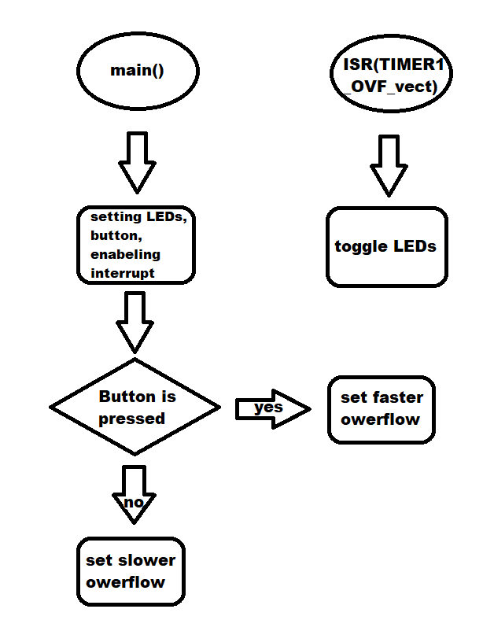
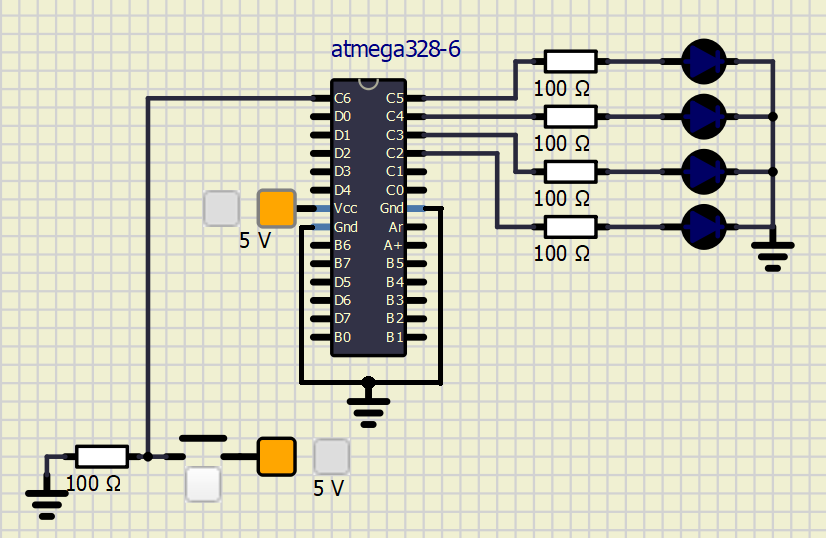

# Lab 4: Petr Medek

Link to my GitHub repository:

   [https://github.com/PedroM42/Digital-electronics-2](https://github.com/PedroM42/Digital-electronics-2)


### Overflow times

1. Complete table with overflow times.

| **Module** | **Number of bits** | **1** | **8** | **32** | **64** | **128** | **256** | **1024** |
| :-: | :-: | :-: | :-: | :-: | :-: | :-: | :-: | :-: |
| Timer/Counter0 | 8  | 16u | 128u | -- | 1m | -- | 4m | 16m |
| Timer/Counter1 | 16 | 4m | 33m | -- | 262m | -- | 1s | 4s |
| Timer/Counter2 | 8  | 16u | 128u | 512u | 1m | 2m | 4m | 16m |


### Timer library

1. In your words, describe the difference between common C function and interrupt service routine.
   * Function - block of instructions which can be called anywhere from the program
   * Interrupt service routine - Runnig program is puased and atention is moved into the interrupt function. When is this function done, paused program starts running from the same point where it stop.

2. Part of the header file listing with syntax highlighting, which defines settings for Timer/Counter0:

```c
/**
 * @name  Definitions of Timer/Counter0
 * @note  F_CPU = 16 MHz
 */
#define TIM0_stop()           TCCR0B &= ~((1<<CS02) | (1<<CS01) | (1<<CS00));
/** @brief Set overflow 4ms, prescaler 001 --> 1 */
#define TIM0_overflow_4ms()   TCCR0B &= ~((1<<CS02) | (1<<CS01)); TCCR0B |= (1<<CS00);
/** @brief Set overflow 33ms, prescaler 010 --> 8 */
#define TIM0_overflow_33ms()  TCCR0B &= ~((1<<CS02) | (1<<CS00)); TCCR0B |= (1<<CS01);
/** @brief Set overflow 262ms, prescaler 011 --> 64 */
#define TIM0_overflow_262ms() TCCR0B &= ~(1<<CS02); TCCR0B |= (1<<CS01) | (1<<CS00);
/** @brief Set overflow 1s, prescaler 100 --> 256 */
#define TIM0_overflow_1s()    TCCR0B &= ~((1<<CS01) | (1<<CS00)); TCCR0B |= (1<<CS02);
/** @brief Set overflow 4s, prescaler // 101 --> 1024 */
#define TIM0_overflow_4s()    TCCR0B &= ~(1<<CS01); TCCR0B |= (1<<CS02) | (1<<CS00);
/** @brief Enable overflow interrupt, 1 --> enable */
#define TIM0_overflow_interrupt_enable()  TIMSK0 |= (1<<TOIE0);
/** @brief Disable overflow interrupt, 0 --> disable */
#define TIM0_overflow_interrupt_disable() TIMSK0 &= ~(1<<TOIE0)
```

3. Flowchart figure for function `main()` and interrupt service routine `ISR(TIMER1_OVF_vect)` of application that ensures the flashing of one LED in the timer interruption. When the button is pressed, the blinking is faster, when the button is released, it is slower. Use only a timer overflow and not a delay library.

   


### Knight Rider

1. Scheme of Knight Rider application with four LEDs and a push button, connected according to Multi-function shield. Connect AVR device, LEDs, resistors, push button, and supply voltage. The image can be drawn on a computer or by hand. Always name all components and their values!

   